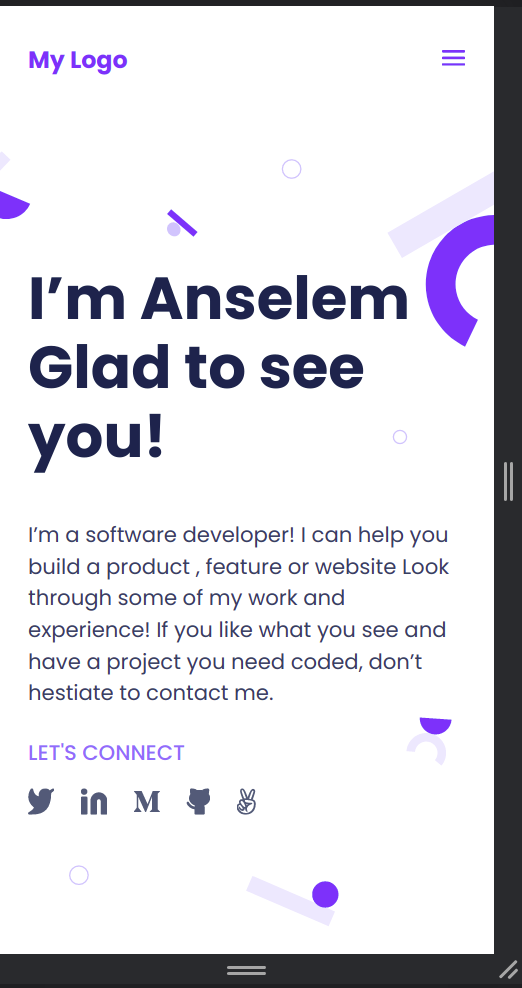

# Microverse Portfolio

> Setup and Mobile Version Skeleton

Additional description about the project and its features.

## Built With

- Major languages - HTML, CSS
- Frameworks - No Frameworks Used
- Tools used - Git(version control), WebHint(linting tool), Stylelint(style linting)

## Live Demo

[View Live Demo](https://anselemodims.github.io/Portfolio/)

## Getting Started

To get a local copy up and running follow these simple example steps.

### Prerequisites
 - A text editor(preferably Visual Studio Code)
### Install
  -  [Git](https://git-scm.com/downloads)
  -  [Node](https://nodejs.org/en/download/)
### Usage
  - Clone the repository using  "git clone git@github.com:AnselemOdims/Portfolio.git"
  -  cd into the project folder
  -  Run npm install

## Authors

👤 **Author1**

- GitHub: [github](https://github.com/AnselemOdims)
- LinkedIn: [LinkedIn](https://www.linkedin.com/in/anselem-odimegwu-65a679104/)

## 🤝 Contributing

Contributions, issues, and feature requests are welcome!

Feel free to check the [issues page](../../issues/).

## Show your support

Give a ⭐️ if you like this project!

## Acknowledgments

- Hat tip to anyone whose code was used
- Inspiration
- etc

## 📝 License

This project is [MIT](./MIT.md) licensed.